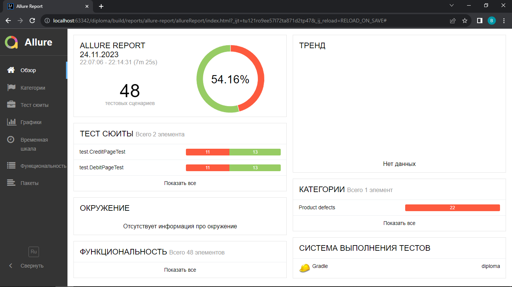
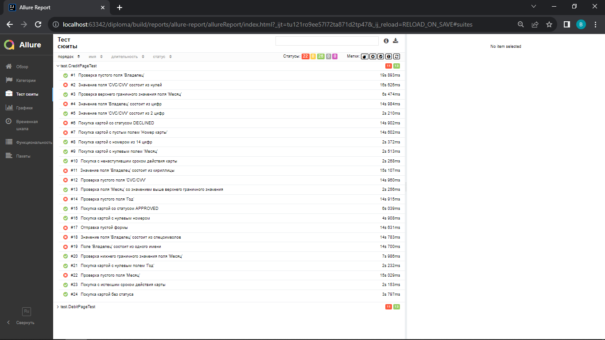
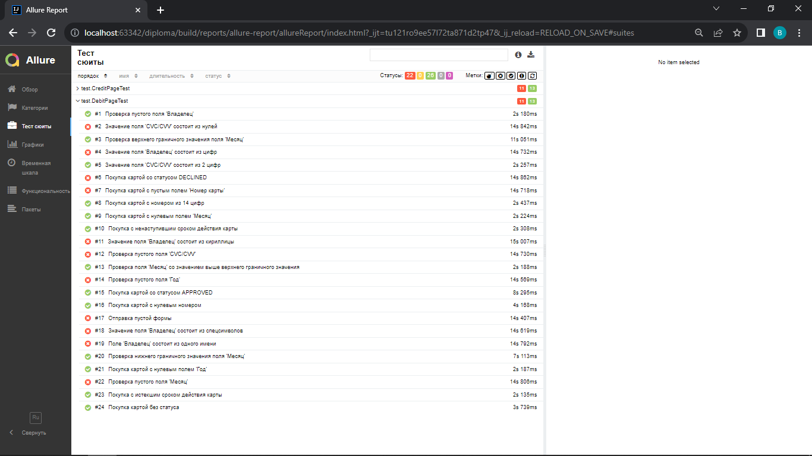

# Отчёт о проведённом тестировании
***
## Краткое описание
В соответствии с тест планом было проведено автоматизированное тестирование приложения "Путешествие дня".

Общее количество проведенных тестов - 48.

### Количество тест-кейсов

Общее количество тест-кейсов - 48:

Покупка дебетовой картой - 24, из них:

* позитивные - 4;

* негативные - 20;

Покупка в кредит - 24, из них:

* позитивные - 4;

* негативные - 20.

Процент успешных тестов - 54.16%, не успешных тестов - 45.84%.

## Общие рекомендации
* Разработать спецификацию, либо другим способом оформить требования для данного приложения;
* Исправить выявленные ошибки;
* Добавить "тестовые" атрибуты в приложение для повышения устойчивости авто-тестов.